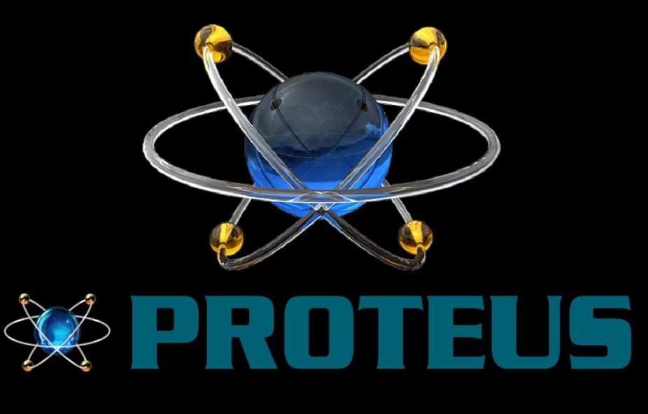

# Retificador de Onda Completa 
Projeto de desenvolvimento de um simulador de Retificador de Onda Completa que serve para retificar a corrente elétrica, transformando a onda para a forma mais linear possível. **Desenvolvedor:** Marco Antônio Andrade, acadêmico do curso de Sistemas de Informação da Universidade Unimater de Pato Branco (PR).

# Ferramentas utilizadas no desenvolvimento:
:black_circle: **Proteus** - é um software para criação de projetos eletrônicos, composto por uma suíte de ferramentas, incluindo captura esquemática, simulação e módulos de projetos de placas de circuito impresso, usadas principalmente para o projeto de circuitos integrados.

<a href="https://github.com/MarcoAndradee">

:black_circle: **TinkerCad** - é um programa de modelagem tridimensional online gratuito que roda em um navegador da web, conhecido por sua simplicidade e facilidade de uso.

<a href="https://github.com/MarcoAndradee">

